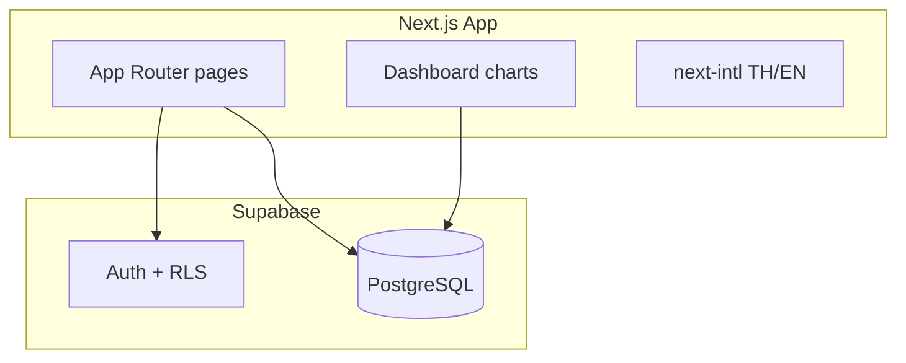

# Iceman Web Application Plan

Replace the Google Sheets ledger with a bilingual (TH/EN) web app backed by PostgreSQL (Supabase), role-based auth, and a chart-rich dashboard.

## Decisions

| Area | Choice |
|------|--------|
| Spreadsheet | **Replace** — web app is system of record |
| Reports | Interactive dashboard (trends, per-store/route, cash vs bank) |
| v1 drivers | Paper on route → bookkeeper enters at branch |
| Auth | Role accounts: `owner`, `bookkeeper`, `driver` (driver login in v2) |
| Hosting | Vercel (app) + Supabase (Postgres + auth), free tier |
| Locale | Bilingual UI (TH/EN), THB |
| Repo | Extend [iceman](https://github.com/m1g88/iceman); keep `CONTEXT.md` as glossary |

`templates/` spreadsheet files remain as reference + optional import source.

## Architecture



**Stack:** Next.js 15 (App Router), TypeScript, Tailwind, shadcn/ui, Recharts, Supabase JS, `next-intl`.

## Data model

Maps from `templates/ice-ledger-structure.csv` and `CONTEXT.md`.

| Table | Spreadsheet tab |
|-------|-----------------|
| `routes` | Settings (routes) |
| `stores` | Settings (stores) |
| `route_sales` | Route_Sales |
| `store_payments` | Store_Payments |
| `expenses` + `expense_categories` | Expenses |
| `inventory_weeks` | Inventory |
| `org_settings` + `store_opening_debts` | Opening_Balances |

**SQL views (computed):**

- `store_balances` — opening + credit sales − payments per store
- `monthly_pl` — income (cash + credit), expenses by group, net
- `monthly_cash_flow` — opening cash/bank + inflows − outflows
- `weekly_inventory_sold` — bags sold per week from `route_sales`

**Enums:** `sale_type` (cash, credit), `payment_method` (cash, bank).

Seed categories: Production, Distribution, Overhead (same list as workbook).

## Roles & RLS

| Role | Permissions |
|------|-------------|
| `owner` | Settings, opening balances, all CRUD, dashboard |
| `bookkeeper` | Sales, payments, expenses, inventory, dashboard read |
| `driver` | v2: own route entry only |

Single-tenant (`organization` row) for family business.

## Directory layout

```
iceman/
  web/                    # Next.js app
    app/[locale]/
      (auth)/login/
      dashboard/
      sales/
      payments/
      expenses/
      stores/
      inventory/
      settings/
    components/forms|charts|layout/
    lib/supabase|queries/
    messages/th.json, en.json
  supabase/
    migrations/
    seed.sql
  docs/web-setup.md
```

## Pages (v1)

| Route | Replaces |
|-------|----------|
| `/dashboard` | Dashboard + Cash_Flow + charts |
| `/sales` | Route_Sales |
| `/payments` | Store_Payments |
| `/expenses` | Expenses |
| `/stores` | Store_Balances |
| `/inventory` | Inventory |
| `/settings` | Settings + Opening_Balances |

## Dashboard features

1. Income vs expenses — monthly trend (12 months)
2. Cash vs credit mix — stacked bars
3. Top stores by revenue
4. Outstanding debt ranking
5. Route comparison — bags + cash per route
6. Inventory variance — produced vs sold weekly
7. Expected cash & bank KPI cards with month picker

## Phases

### Phase 1 — MVP (replace sheet)
- [ ] Supabase schema + RLS + seed
- [ ] Next.js scaffold, auth, i18n
- [ ] CRUD: sales, payments, expenses
- [ ] Store balances view
- [ ] Basic dashboard: P&L + debt list

### Phase 2 — Full dashboard
- [ ] All charts above
- [ ] Inventory + settings (routes, stores, opening balances)
- [ ] Mobile-responsive forms

### Phase 3 — Polish
- [ ] Driver role UI
- [ ] xlsx import script
- [ ] CSV/PDF export

### Phase 4 — Offline (future)
- [ ] PWA + IndexedDB sync on route

## Deploy

**Env:** `NEXT_PUBLIC_SUPABASE_URL`, `NEXT_PUBLIC_SUPABASE_ANON_KEY`

**Local:**
```bash
cd web && npm install
npx supabase start && npx supabase db push
npm run dev
```

**Prod:** Vercel (root `web/`) + Supabase cloud project.

## Cutover

1. Enter opening balances in Settings
2. Optional: import xlsx via script
3. Stop editing Google Sheet; use web app only

## Out of scope (v1)

- Tax invoices (ใบกำกับภาษี)
- Multi-org / multi-location
- Bank API import
- Native mobile apps

## Implementation todos

1. `supabase-schema` — migrations, views, RLS, seed
2. `nextjs-scaffold` — Next.js + Tailwind + shadcn + next-intl + auth
3. `crud-pages` — sales, payments, expenses forms
4. `balances-inventory` — stores page, inventory, settings
5. `dashboard` — Recharts dashboard
6. `deploy-docs` — web-setup.md, CONTEXT.md update, ADR 0001
